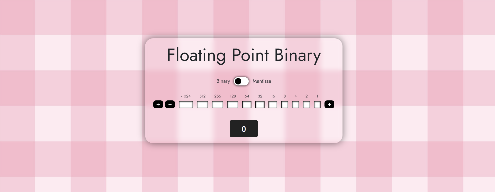

<h1 align="center">Floating Point Binary</h1>

  <b>Mantissa is veryyy confusing.</b>

<!-- 

 -->

## ✨ Features

- Floating point binary calculator created using html, css and vanilla javascript.
- Uses bootstrap
- Allows 16 bit fixed-point binary number

## 📋 To-do List

- Make responsive

## 📜 Credits

Everything is coded by Alex lo Storto unless otherwise noted

Licensed under the MIT License.
