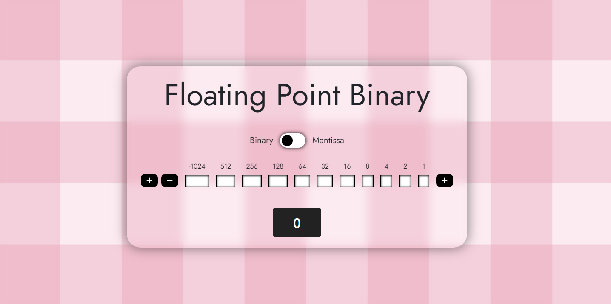

<h1 align="center">Floating Point Binary</h1>

  <b>Mantissa is veryyy confusing.</b>

<!-- 

 -->

## ✨ Features

- Uses two's complement
- Automatically converts fixed point binary to mantissa and exponent
- Range of fixed binary value can be adjusted
- Allows 16-bit fixed-point binary number

## 💻 Code

- Uses bootstrap
- Created using html, css and vanilla javascript
- PHP used for modularisation

## 📋 To-do List

- Make responsive

## 📜 Credits

Everything is coded by Alex lo Storto unless otherwise noted

Licensed under the MIT License.
